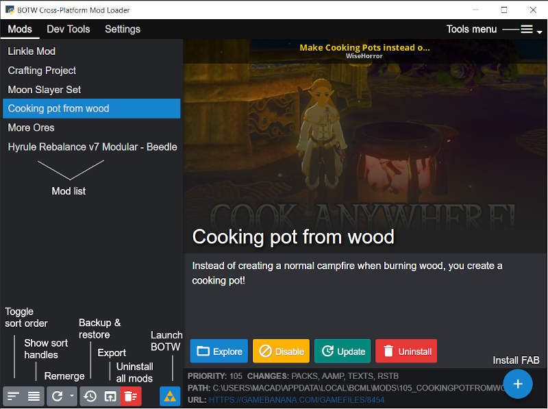

# BCML: BOTW Cross-Platform Mod Loader with macOS Launcher

A mod merging and managing tool for _The Legend of Zelda: Breath of the Wild_ with a native macOS application launcher.


## Table of Contents

- [Purpose](#purpose)
- [Prerequisites](#prerequisites)
- [macOS Setup](#macos-setup)
- [BCML macOS Launcher](#bcml-macos-launcher)
- [Using BCML](#using-bcml)
  - [Installing Mods](#installing-mods)
  - [Managing Mods](#managing-mods)
  - [Exporting Mods](#exporting-mods)
  - [The BNP Format](#the-bnp-format)
- [Troubleshooting](#troubleshooting)
- [Do's and Don'ts](#dos-and-donts)
- [Contributing and License](#contributing-and-license)

## Purpose

Why a mod loader for BOTW? Installing a mod is usually easy enough once you have a
homebrewed console or an emulator. Is there a need for a special tool?

Yes. As soon as you start trying to install multiple mods, you will find complications.
The BOTW game ROM is fundamentally structured for performance and storage use on a
family console, without any support for modification. As such, files like the
[resource size table](https://zeldamods.org/wiki/Resource_system) or
[TitleBG.pack](https://zeldamods.org/wiki/TitleBG.pack) will almost inevitably begin to
clash once you have more than a mod or two. Symptoms can include mods simply taking no
effect, odd bugs, actors that don't load, hanging on the load screen, or complete
crashing. BCML exists to resolve this problem. It identifies, isolates, and merges the
changes made by each mod into a single modpack that just works.

## Prerequisites

- macOS 10.15 Catalina or later
- A legal, unpacked game dump of _The Legend of Zelda: Breath of the Wild_ for Switch
  (version 1.6.0) or Wii U (version 1.5.0)
- Python 3.9 or later (for macOS)
- Cemu (optional for Wii U mods)

## macOS Setup

Running BCML on macOS requires some additional setup.

### Additional Prerequisites for macOS

- CMake 3.12 or later
- Xcode Command Line Tools (`xcode-select --install`)
- [Homebrew](https://brew.sh) (recommended for dependency management)
- Python 3.9 or later installed via Homebrew

### Installation Options

#### 1. Bootstrap Script (Recommended)

A `bootstrap_macos.sh` file is included to perform all of the build steps in a virtual environment:

```bash
chmod +x bootstrap_macos.sh
./bootstrap_macos.sh
```

#### 2. Install from Wheel

Download the wheel corresponding to your architecture and Python version from [here](https://github.com/neebyA/BCML/releases), and install with:

```bash
pip install <path_to_wheel>
```

Example: `pip install ~/Downloads/bcml-3.10.8-cp310-cp310-macosx_10_14_x86_64.whl`

Note: On Apple Silicon, install PyQt5 and Python through Homebrew first:

```bash
brew install python@3.9
brew install pyqt@5
```

#### 3. Manual Build

For Apple Silicon:
```bash
brew install python@3.9
brew install pyqt@5
/opt/homebrew/bin/python3.9 -m venv --system-site-packages venv
source venv/bin/activate
```

Then follow these steps:

1. Install Python requirements: `pip install -r requirements.txt`
2. Install Maturin: `pip install maturin`
3. Build Rust extension: `maturin develop --release`
4. Prepare the webpack bundle:
   ```bash
   cd bcml/assets
   npm install
   npm run build
   ```
5. Build the docs: `mkdocs build`
6. Create a wheel or run without installing: `maturin build` or `python -m bcml`

## BCML macOS Launcher

The BCML-macOS-Launcher is a simple, lightweight wrapper application that allows users to launch BCML directly from their Applications folder or Dock, without needing to use Terminal commands. This project streamlines the user experience for macOS users by:

- Providing a native macOS application experience
- Setting required environment variables automatically (including `QTWEBENGINE_DISABLE_SANDBOX=1`)
- Ensuring a smooth integration with macOS
- Offering a visually appealing icon in your Dock and Applications folder

### Installation of macOS Launcher

#### Method 1: Download and Install the Pre-built App

1. Download the latest DMG file from the [Releases](https://github.com/MetalOath/BCML-macOS-App/releases) page
2. Mount the DMG file by double-clicking it
3. Drag the BCML app to your Applications folder
4. Unmount the DMG by dragging it to the Trash

#### Method 2: Build the Launcher from Source

1. Make the build script executable:
   ```bash
   chmod +x BCML-macOS-Launcher/scripts/build.sh
   ```

2. Run the build script:
   ```bash
   ./BCML-macOS-Launcher/scripts/build.sh
   ```

3. The built application will be available in the `BCML-macOS-Launcher/build` directory, along with a DMG file ready for distribution

### Using the macOS Launcher

1. Launch BCML from your Applications folder or Dock
2. If launching for the first time, you may need to right-click (or Control+click) the app and select "Open" to bypass macOS security restrictions
3. BCML will launch with the appropriate environment settings

### Troubleshooting the macOS Launcher

If you encounter issues:

- Ensure BCML is properly installed with all dependencies
- Check that the virtual environment is activated and BCML works when run from Terminal
- For permission errors, ensure the app has execution permissions

## Using BCML



### Installing Mods

There are two main ways to install mods into BCML:

1. **GameBanana one-click**: Go to GameBanana in your browser, find a mod, and click the "BCML 1-Click Install" button.

2. **Manual installation**: Click the floating action button on the Mods tab in BCML. You can also drag-and-drop files onto the BCML window. BCML supports two kinds of mods: graphic packs (Wii U only) and BNPs (Wii U/Switch).

When selecting mods manually, you can either choose a packaged mod (BNP, ZIP, 7z, or RAR file) or select the meta file (`info.json` or `rules.txt`) in an unzipped mod folder.

You can add multiple mods to the installation dialog and sort them. The last mod on the list will take priority over others. Once you've added all desired mods, click "Install" or "Queue."

### Managing Mods

Once you have installed mods, you can manage them in the main BCML window:

- **Viewing Mod Info**: Select a mod to see its name, description, load priority, installation path, and types of changes it makes.

- **Managing Load Order**: By default, mods are sorted from highest to lowest priority. You can customize the load order by clicking "Show sort handles" and using drag-and-drop. After sorting, click "Apply Pending Changes" to process the new order.

**Load Order Tips**:
- Skins should generally be higher priority than behavior or stat edits
- Optional components and compatibility patches should be higher priority than their base mods
- Complex overhaul mods may need special handling

**Other Functions**:
- **Remerge**: If you make manual changes or encounter issues, click "Remerge" to process all mods from scratch.
- **Backup and Restore**: Save your mod configuration for easy restoration later.

### Exporting Mods

For console users, you'll need to export your installed mods as a combined pack:

1. Install all desired mods
2. Click "Remerge" to ensure proper merging
3. Click "Export" to save a combined mod pack
4. BCML will create a ZIP or 7Z file with the merged build of all your mods
   - For Wii U: The export will include `content` and/or `aoc` folders
   - For Switch: The export will contain folders for each title ID with a `romfs` folder in each

### The BNP Format

BCML uses its own format called BNP (BOTW Nano Patch) for mods.

**Creating BNPs**:
1. Go to the Dev Tools tab in BCML
2. Fill out metadata (name, version, description)
3. Define settings like dependencies and optional components
4. Select the folder containing your mod files with the appropriate structure

**Folder Structure for Switch**:
```
.
├── 01007EF00011E000
│   └── romfs
├── 01007EF00011F001 (optional: for DLC files)
│   └── romfs
└── options (optional: for optional components)
    ├── option1 (any name allowed)
    │   ├── 01007EF00011E000
    │   │   └── romfs
    │   └── 01007EF00011F001
    │       └── romfs
    └── ...
```

## Troubleshooting

**_Any time you have problems with mods in-game after installing through BCML, first try using the Remerge button._**

### Setup Issues

#### How do I get an unpacked game dump?
Follow the instructions from [this tutorial](https://zeldamods.org/wiki/Help:Dumping_games).

#### Setting up game folders in BCML

**Base Game**: Must be the root folder for the BOTW ROM. For Switch, this will be the `romfs` folder under the base game title ID. You can tell this folder is set correctly if it contains the file `Pack/Dungeon000.pack`.

**Update**: For Wii U only. Must be the root content folder for BOTW's update files. Switch users should not need an update folder.

**DLC**: Optional. Must be the folder containing the latest paid DLC files. For Switch, this will be the `romfs` folder under the DLC title ID.

### Common Problems

#### BCML takes me back to the setup wizard each time
Your settings, probably the game folders, are incorrect and need to be fixed.

#### I've installed mods, but they don't take effect
Possible causes:
1. The "Use BCML without a Cemu installation" setting is on
2. You need to enable the BCML graphic pack in Cemu
3. Try restarting both BCML and Cemu and remerge
4. Enable the "Disable hard links for master mod" setting

#### New items added by mods have no names or descriptions
Make sure your region and language settings in BCML match your game, then remerge.

#### BOTW crashes immediately when loading
Possible causes:
1. Your load order is incorrect
2. Your game language in BCML doesn't match the region/language in BOTW
3. Your game directory settings in BCML are incorrect
4. There's an issue with one of your mods
5. The mods you're using are incompatible with each other
6. Your game dump is corrupt

## Do's and Don'ts

### Do's

- **Do** use the backup and restore feature
- **Do** read the tooltips throughout the UI for helpful information
- **Do** use the "Copy to Clipboard" button on error dialogs when reporting errors

### Don'ts

- **Don't** use BCML alongside other methods of installing mods (except community graphic packs and code patches)
- **Don't** report issues without being specific about mods, platform, BCML version, etc.
- **Don't** expect all mod combinations to work properly

## Contributing and License

- Issues: [https://github.com/NiceneNerd/BCML/issues](https://github.com/NiceneNerd/BCML/issues)
- Source: [https://github.com/NiceneNerd/BCML](https://github.com/NiceneNerd/BCML)

The BCML software is licensed under the GNU General Public License, version 3 or later.

The macOS Launcher is licensed under the MIT License.

This software includes:
- The 7-Zip console application and library, licensed under the GNU Lesser General Public License
- Part of a modified copy of the `pywebview` Python package, copyright 2020 Roman Sirokov under the BSD-3-Clause License

## Acknowledgments

- [NiceneNerd](https://github.com/NiceneNerd) for the original BCML
- [neebyA](https://github.com/neebyA) for the macOS fork of BCML
- [MetalOath](https://github.com/MetalOath) for the macOS Launcher integration
- The BOTW modding community
